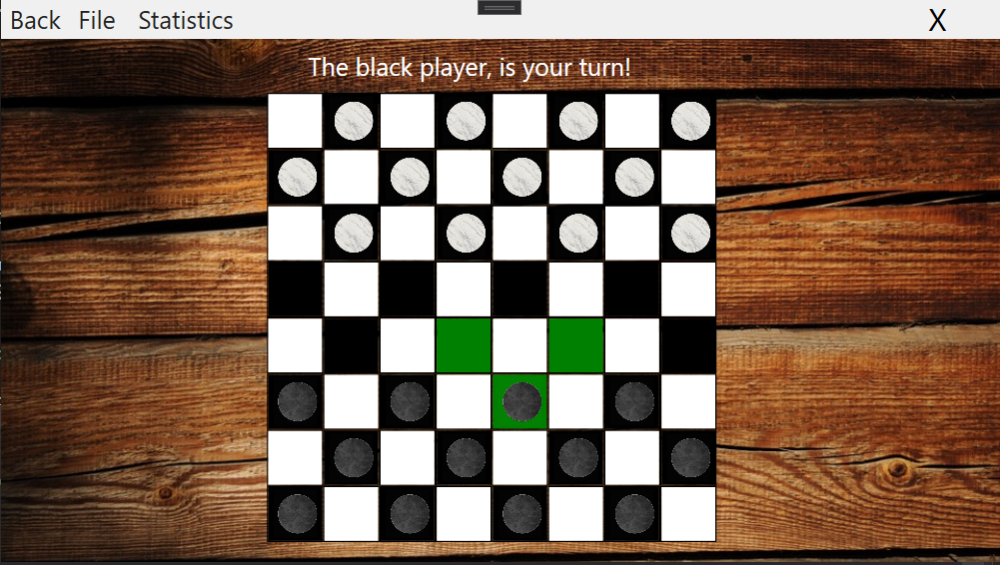
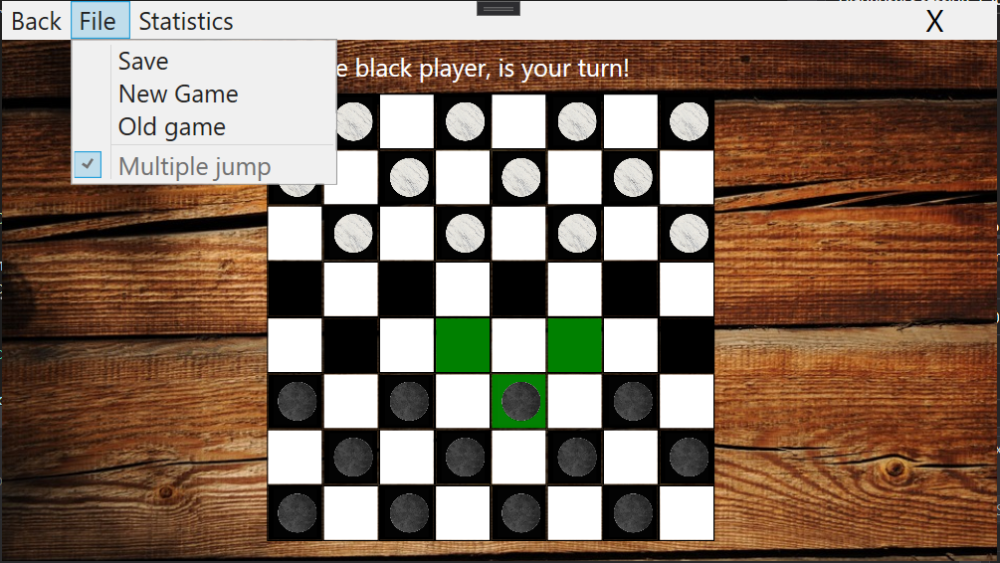

# Checkers (dame)
A two players checkers game made in WPF following the MVVM structure.

# Features
* The rules are presented in game
* You can choose whether or not you want to play with double jumps
* You can save the state of the game in a XML file and restore it later
* You can see statistics

